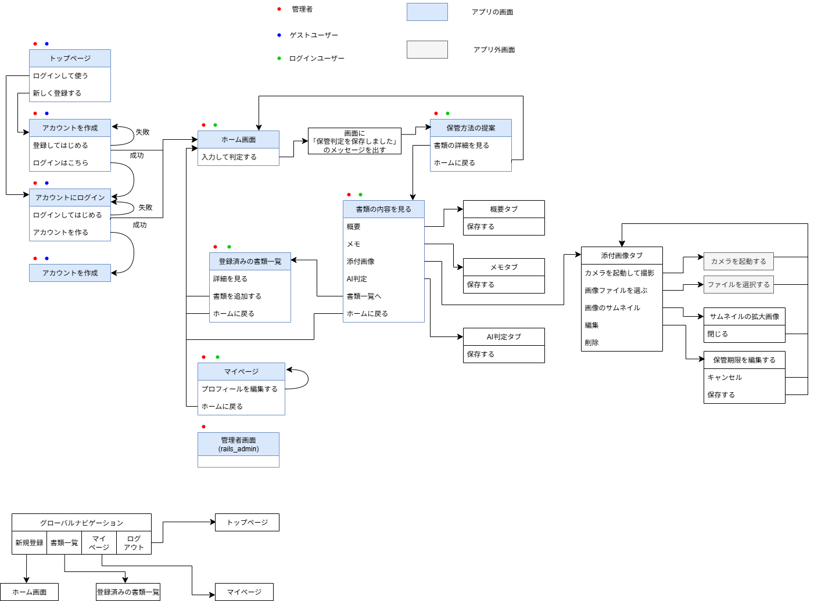

# README
## 開発言語
* Ruby 3.3.0
* Ruby on Rails 7.1.5.1
* PostgreSQL 16.9
## 実行手順
```
$ git clone https://github.com/moaoyama/org_app_tottoku.git
$ cd tottoku
$ bundle install
$ rails db:create
$ rails db:migrate
$ rails server
```
## カタログ設計
https://docs.google.com/spreadsheets/d/14RHf9ebWHiROU02kUgCNGh6alsyEY4iLPzAmOtALcbo/edit?usp=sharing
## テーブル定義書
https://docs.google.com/spreadsheets/d/14RHf9ebWHiROU02kUgCNGh6alsyEY4iLPzAmOtALcbo/edit?usp=sharing
## ワイヤーフレーム
https://www.figma.com/design/ZeuNnnybtR2WpXlN99WQ93/%E3%82%AA%E3%83%AA%E3%82%B8%E3%83%8A%E3%83%AB%E3%82%A2%E3%83%97%E3%83%AA%E3%83%AF%E3%82%A4%E3%83%A4%E3%83%BC%E3%83%95%E3%83%AC%E3%83%BC%E3%83%A0--%E3%82%B3%E3%83%B3%E3%83%91%E3%82%AF%E3%83%88%E7%89%88-?node-id=0-1&t=216Y0VVRDcNffHny-1
## ER図

## 画面遷移図
