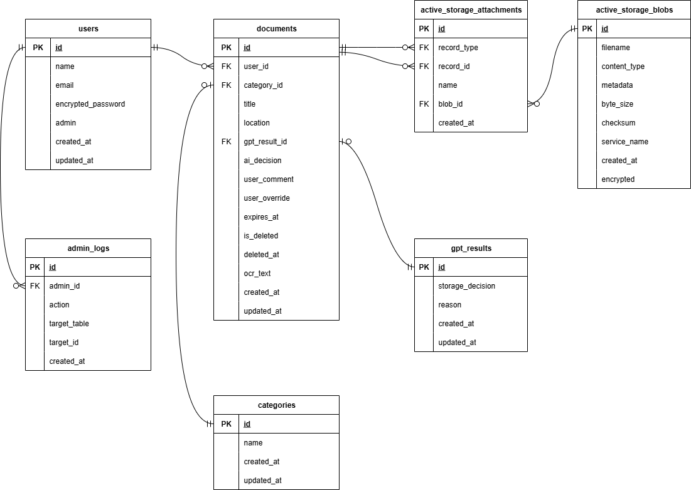
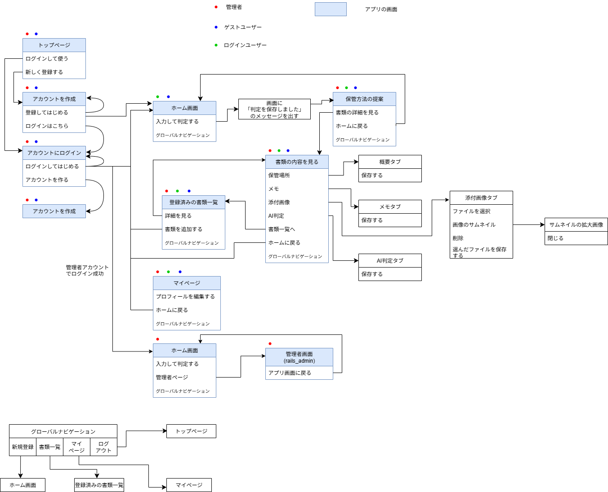

# README

## 概要

このアプリは
「紙の書類が多くて悩んでいる人」の
「捨てるべきか判断できず、紙が溜まっていく」課題を
「書類名からAIが判断して整理をサポートすること」で解決するアプリです。

## スクリーンショット

[ログイン画面](./docs/A_login1.png)  
[ゲストログイン機能](./docs/A_login2-2-1.png)  
[書類名登録](./docs/B_result1.png)  
[判定結果](./docs/B_result3.png)  

## 主な機能

- 書類の保管判定(3段階)  
入力された書類名をもとに「原本保管」「データ保管」「破棄OK」のいずれかをAIが提示します。
- 書類一覧の表示  
登録された書類の名前・判定・登録日時を一覧表示。
見返しがしやすくなります。
- 書類画像の追加・保存機能  
ユーザーがス画像フォルダから選択してアップロードすることで、書類名と書類画像を紐づけて保存できます。
- ユーザー登録機能  
自分専用のアカウントを作成することで、書類の整理や保存ができるようになります。
他の人と情報が混ざらず、自分のデータを安全に管理できます。
- ログイン・ログアウト機能  
アカウントから安全にログアウトすることで、他人に自分のデータを見られる心配がなくなります。共有パソコンでも安心して使えます。

## 技術スタック

- Ruby 3.3.0
- Ruby on Rails 7.1.5.1
- PostgreSQL 16.9

過去に以下の技術を検討・実装していましたが、
アプリの目的と規模をふまえ、現在は使用していません。

- OpenAI API
- Devise
- Amazon S3

## 実行手順

```bash
git clone https://github.com/moaoyama/org_app_tottoku.git
cd tottoku
bundle install
rails db:create
rails db:migrate
rails server
```

## テーブル定義書

[テーブル定義書](https://docs.google.com/spreadsheets/d/1EGYJfKLEOeP8bh_swWy5xRTqee-GMHumfzjqcUoorLg/edit?usp=sharing)

## ER図



## 画面遷移図


