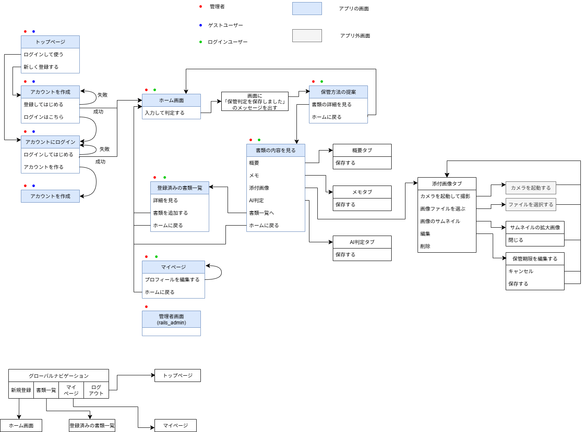

# README

## 概要

このアプリは
「紙の書類が多くて悩んでいる人」の
「捨てるべきか判断できず、紙が溜まっていく」課題を
「書類名からAIが判断して整理をサポートすること」で解決するアプリです。

## 主な機能

## 技術スタック

* Ruby 3.3.0
* Ruby on Rails 7.1.5.1
* PostgreSQL 16.9
* Devise

## 実行手順

```bash
git clone https://github.com/moaoyama/org_app_tottoku.git
cd tottoku
bundle install
rails db:create
rails db:migrate
rails server
```

## テーブル定義書

[テーブル定義書](https://docs.google.com/spreadsheets/d/14RHf9ebWHiROU02kUgCNGh6alsyEY4iLPzAmOtALcbo/edit?usp=sharing)

## ER図


## 画面遷移図


